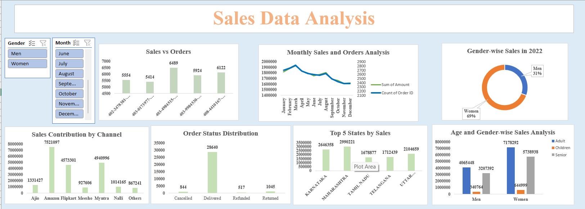

# Sales Data Analysis Dashboard

## Project Overview
This project analyzes store sales data using Microsoft Excel.  
An interactive dashboard was created to identify sales trends, customer behavior, top-performing states, and sales channels.

---

## Problem Statement
The business had large raw sales data but faced difficulty in understanding:

- Which month generated highest sales
- Which gender purchased more products
- Which states contributed maximum revenue
- Which sales channel performed best
- Customer age group contribution
- Order delivery performance

The raw dataset was difficult to interpret and decision-making was time-consuming.

---

## Solution
An interactive Excel dashboard was developed using Pivot Tables, Pivot Charts, and Slicers to transform raw sales data into meaningful business insights.

The dashboard helps businesses:
- Monitor sales performance
- Track customer behavior
- Identify top-performing states and channels
- Analyze order status
- Understand demographic trends

---

## Objectives
- Compare sales and orders
- Identify highest sales month
- Analyze gender-based purchases
- Analyze order status
- Find top contributing states
- Understand age and gender relation
- Identify best sales channel

---

## Tools & Technologies Used
- Microsoft Excel
- Pivot Tables
- Pivot Charts
- Slicers
- Data Cleaning
- Data Visualization

---

## Dashboard Features
- Interactive dashboard
- Dynamic filtering using slicers
- Monthly sales analysis
- Gender-wise analysis
- Channel-wise analysis
- State-wise analysis
- Order status tracking
- Age group analysis

---

## Key Insights

### 1. Women Contributed More Sales
- Women generated approximately 69% of total sales.
- Female customers were the major buyers.

### 2. Adults Generated Highest Revenue
- Adult age group contributed maximum sales.
- Children category contributed least.

### 3. Maharashtra Was the Top Performing State
- Maharashtra generated highest sales revenue.
- Karnataka and Uttar Pradesh also contributed significantly.

### 4. Amazon Was the Best Performing Sales Channel
- Amazon contributed the highest sales among all channels.
- Flipkart and Myntra also showed strong performance.

### 5. Most Orders Were Successfully Delivered
- Majority of orders were delivered successfully.
- Very few orders were cancelled, refunded, or returned.

### 6. March Recorded Highest Sales
- Sales peaked during March.
- Sales gradually decreased towards the end of the year.

### 7. Sales Trends Were Identified
- Seasonal sales fluctuations were observed.
- Businesses can use this information for better planning and marketing strategies.

---

## Dashboard Preview

---

## Conclusion
The dashboard transformed raw sales data into meaningful business insights and improved understanding of customer behavior, sales trends, operational performance, and business growth opportunities.

---

## Project Files
- Excel Dashboard File
- Dashboard Screenshot
- README Documentation

---

## Author
Bhoomika Gouda
